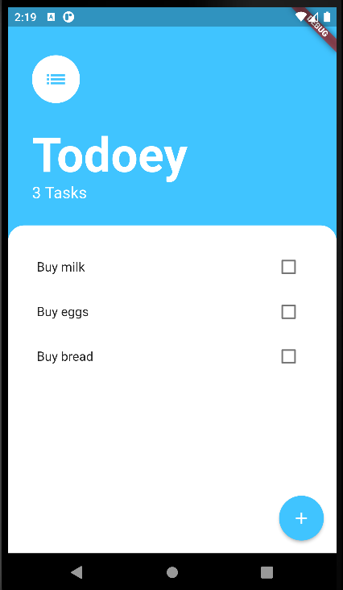
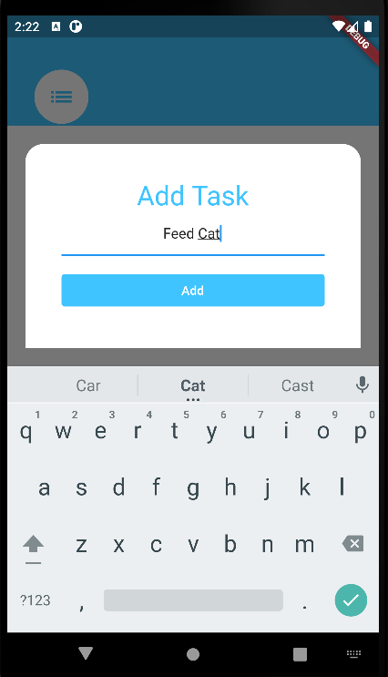
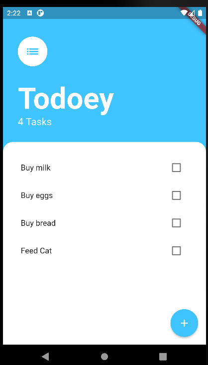

# todoey

In this project,User can their to do list.

# Contents:

* ChangeNotifierProvider
* showModalBottomSheet
* and many more...

# How to Install and Run the Project:

You can run this project:

1. Direct on Android Studio Emulator by this [link](https://github.com/RashadZA/todoey)
2. Physical Device. [Apk_link](https://drive.google.com/file/d/1p1s_Rz7LiKmYutzLIB--Be6urklJeDqI/view?usp=sharing)

# How to Use the Project:

* Run this project on emulator or device.
* You will see a Task page.
* When you click  add button(FloatingActionButton) bottom sheet will come up.
* Then you type your task in TextField.
* After clicking add button you will see your task added in the task page.

## Screenshots:

</img>
</img>
</img>
</img>

